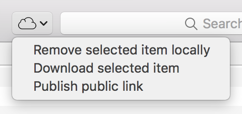

# A note about macOS Catalina

macOS Catalina (10.15) includes new functionality that makes iCloud Control redundant.

- In the context menu, accessible by right clicking on a file / folder in iCloud, there are two new options:
    - **Download Now**: Works the same as the "Download selected item" option in iCloud Control
    - **Remove Download**: Works the same as the "Remove selected item locally" option in iCloud Control
- You can now share files in iCloud by using the share menu and choosing "Add People". To obtain a public link, select "Copy Link", and then under "Share Options", "Who can access", choose "Anyone with the link".

Because of these changes, it is time to retire iCloud Control. I will no longer be maintaining it, but will leave the repository online for those that may still find it useful for older macOS versions.

# iCloud Control

Adds a menu to the Finder that allows control over files stored iCloud, allowing user-controlled selective synchronization.

## Installation

- [Download the latest version here](https://github.com/Obbut/iCloud-Control/releases)
- Place the app in your Applications folder
- Launch it by right/control clicking and choosing "Open" (to prevent gatekeeper from preventing the app to open) and follow the instructions on screen

## Usage

The following options are provided trough a toolbar item in the Finder.

- **Remove selected item locally**: the selected item(s) will be removed from your device, while remaining in iCloud.
- **Download selected item**: download previously removed files from iCloud. On macOS Sierra, the cloud icon provides the same functionality.
- **Publish public link**: places a link to the selected file in your clipboard.

## Compatibility

iCloud Control should work on macOS 10.2 Sierra, and on OS X 10.11 El Capitan.

## License

iCloud Control is licensed under the MIT license. In addition to the restrictions placed by the MIT license, **you are not permitted and will not get permission to list iCloud Control or any derivative work on software catalogue websites like Mac Informer or MacUpdate.**

The MIT License (MIT)

Copyright (c) 2016 Robbert Brandsma

Permission is hereby granted, free of charge, to any person obtaining a copy of this software and associated documentation files (the "Software"), to deal in the Software without restriction, including without limitation the rights to use, copy, modify, merge, publish, distribute, sublicense, and/or sell copies of the Software, and to permit persons to whom the Software is furnished to do so, subject to the following conditions:

The above copyright notice and this permission notice shall be included in all copies or substantial portions of the Software.

THE SOFTWARE IS PROVIDED "AS IS", WITHOUT WARRANTY OF ANY KIND, EXPRESS OR IMPLIED, INCLUDING BUT NOT LIMITED TO THE WARRANTIES OF MERCHANTABILITY, FITNESS FOR A PARTICULAR PURPOSE AND NONINFRINGEMENT. IN NO EVENT SHALL THE AUTHORS OR COPYRIGHT HOLDERS BE LIABLE FOR ANY CLAIM, DAMAGES OR OTHER LIABILITY, WHETHER IN AN ACTION OF CONTRACT, TORT OR OTHERWISE, ARISING FROM, OUT OF OR IN CONNECTION WITH THE SOFTWARE OR THE USE OR OTHER DEALINGS IN THE SOFTWARE.
